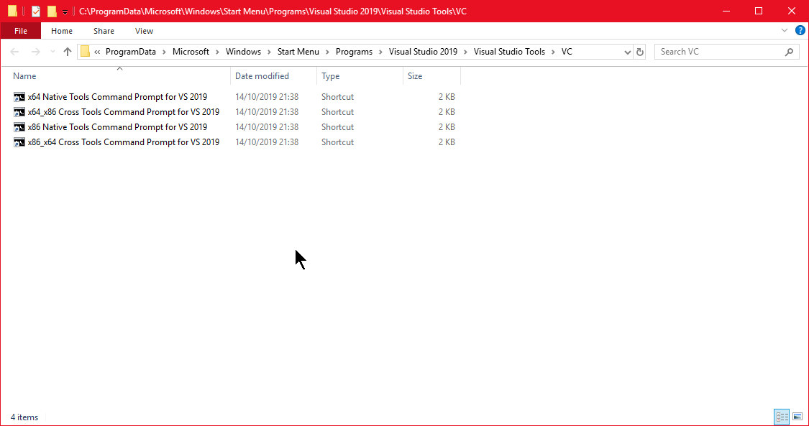

Summer School 2020 Test Data Geneerator
=======================================

Contains: `genplate` and `gencube`.

Usage: `genplate|gencube` `number_of_nodes_per_side` `length_in_mm` `deformation_amplitude_in_mm` `number_of_modes`

If you run `make`, it will generate the following:

- a 100x100 plate with a hole in it and 100 harmonic modes
- a 16x16x16 cube with a hole in it and 16 harmonic modes
- a 32x32x32 cube with a hole in it and 16 harmonic modes
- a 100x100x100 cube with a hole in it and 16 harmonic modes

If you're on windows, you need to run `make` in "x64 Native Tools Command Prompt for VS 2019", because it requires a pretty up-to-date compiler and OpenMP support. See also .

If you're on Linux on a distro like CentOS 7, you need a modern compiler like gcc 7.3.1 obtained via scl and devtoolset-7; in that case, run `scl enable devtoolset-7 'make'`. It *should* work out of the box on Ubuntu & friends. If you get errors like "something something sandybridge", you can remove the compiler flags to get it to compile in legacy Pentium II mode, single threaded; it will work, but slowly.

ParaView
--------

The test data generators also output TecPlot files, which ParaView can open. The `*.pvsm` files contain pre-made sessions for the plate and a cube, which involves loading the files up, merging the dxdydz components into a vector, and applying deformations. You can use this to inspect generated files.

File format
-----------

The `nodes.txt` contains nodal coordinates as `%lf %lf %lf` = (x, y, z) per line.

The `mode-*.txt` files contain nodal displacements as `%lf %lf %lf` = (dx, dy, dz) per line. A line in `nodes.txt` corresponds to a line in `mode-*.txt`.

The `connect.txt` file contains element connectivity, consisting of an element type, followed by int64 0-based indices into the `nodes.txt` file.

| element type | format                                                |
|--------------|-------------------------------------------------------|
| triangle     | `TR %ld %ld %ld`                                      |
| tetrahedron  | `TE %ld %ld %ld %ld`                                  |
| quad         | `QU %ld %ld %ld %ld`                                  |
| hexahedron   | `HE %ld %ld %ld %ld %ld %ld %ld %ld`                  |
| pyramid      | `PY %ld %ld %ld %ld %ld`                              |
| wedge        | `WE %ld %ld %ld %ld %ld %ld`                          |

Nodal results need to be mapped to element faces or element volumes.

The `*.tec` files are in TecPlot format, c.f. [this link](http://home.ustc.edu.cn/~cbq/360_data_format_guide.pdf) p341.
